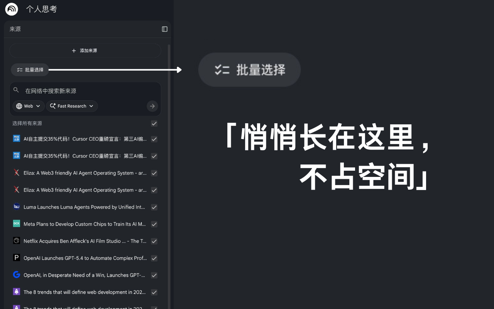
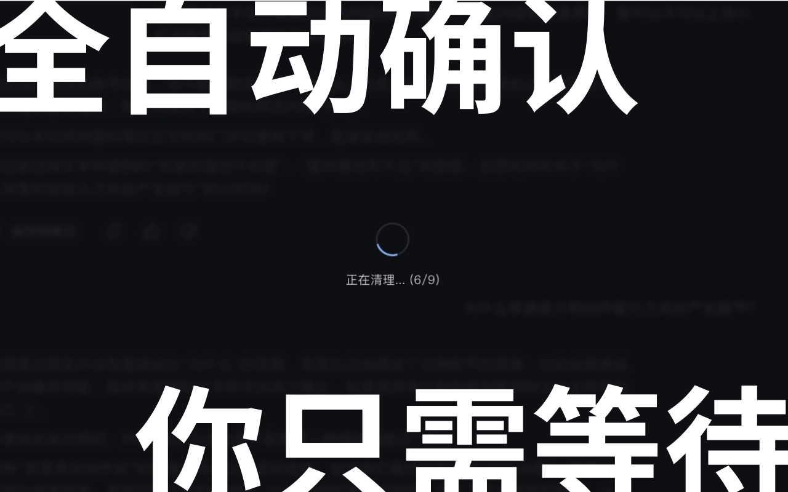

# NotebookLM Source Cleaner

> 为 Google NotebookLM 来源列表注入**批量选择与一键删除**功能的 Chrome 浏览器插件（Manifest V3）  
> 深度融合 Material Design 3 界面，静默无痕，告别逐条手动点击。

---

## 效果预览

| 悄悄长在这里，不占空间 | 勾选即选中，随时退出批量 | 全自动确认，你只需等待 |
|:---:|:---:|:---:|
|  |  |  |

---

## 功能一览

| 功能 | 说明 |
|---|---|
| ☑ 批量选择模式 | 来源列表顶部工具栏一键开启，每条来源前出现圆形 Checkbox |
| 删除选中 | 勾选多条后点击「删除选中」，自动串行完成所有弹窗确认，全程无需人工干预 |
| 零干扰加载蒙层 | 删除期间显示半透明进度蒙层，Angular 确认弹窗被静默遮蔽，界面不闪烁 |
| SPA 路由感知 | 内置全局路由守卫（Global Guardian），在笔记本间跳转后工具栏自动重新挂载 |
| Material Design 3 | 按钮、图标、颜色完全使用 NotebookLM 原生 `google-symbols` 字体与暗色调色板 |
| 动态注入 | MutationObserver 监听，新增来源自动挂载 Checkbox |

---

## 安装方法

1. 打开 Chrome，地址栏输入 `chrome://extensions/`
2. 右上角开启**开发者模式**
3. 点击**加载已解压的扩展程序**
4. 选择本项目文件夹（`NotebookLM-Source-Cleaner/`）
5. 打开 `https://notebooklm.google.com`，左侧来源列表即可使用

---

## ⚠️ DOM 选择器维护指南（重要）

NotebookLM 是动态 SPA，CSS class 名可能随版本更新而变化。  
所有选择器集中在 `content.js` 顶部的 `SELECTORS` 对象中：

### 如何更新选择器

1. 在 Chrome 中打开 `https://notebooklm.google.com`
2. 打开开发者工具（`F12` 或 `Cmd+Option+I`）
3. 切换到 **Elements** 面板
4. 按照下表，逐一找到对应元素，复制其选择器

### 选择器速查表

| 字段名 | 作用 | 查找方法 |
|---|---|---|
| `SIDEBAR` | 来源面板的侧边栏根容器 | 找包裹整个来源列表的 `<section>` 节点 |
| `SOURCE_ITEM` | 单条来源的行元素 | 找每条资料对应的重复出现的行节点 |
| `MENU_BTN` | 每条来源右侧的 `⋮` 菜单按钮 | hover 某条来源，右键检查出现的三点按钮 |
| `DELETE_MENU_ITEM` | 弹出菜单中的「删除」选项按钮 | 手动点击 `⋮` 后，在 Elements 中查看 overlay 层 |
| `ADD_SOURCE_AREA` | 「添加来源」按钮所在区域 | 找侧边栏顶部 「＋ 添加来源」按钮 |

### 当前生效的选择器（已验证）

```js
const SELECTORS = {
  SIDEBAR:          'section.source-panel',
  SOURCE_ITEM:      '.single-source-container',
  MENU_BTN:         'button.source-item-more-button',
  DELETE_MENU_ITEM: 'button.more-menu-delete-source-button',
  ADD_SOURCE_AREA:  'button.add-source-button',
};
```

> **技巧**：在 Elements 面板中，右键某个元素 → Copy → Copy selector，可以直接得到可用的 CSS 选择器。  
> **诊断**：在控制台执行 `nlmDebug()` 可打印当前所有选择器的命中状态。

---

## 项目结构

```
NotebookLM-Source-Cleaner/
├── manifest.json    # MV3 清单，声明权限与内容脚本
├── content.js       # 核心逻辑（注入 / 模拟删除 / MutationObserver / SPA 守卫）
├── style.css        # 注入元素的样式（Material Design 3 深色主题）
├── icons/           # 扩展图标（16 / 48 / 128 px）
└── README.md        # 本文档
```

---

## 技术说明

### 批量删除流程（全自动 DOM 模拟）

```
点击「批量选择」→  为每条来源注入圆形 Checkbox
勾选目标来源   →  点击「删除选中」
               →  displayLoadingOverlay()  挂载全屏蒙层
               →  for each checkbox (串行):
                    simulateClick(⋮ 按钮)   打开弹出菜单
                    waitForElement(删除选项)  等待菜单渲染
                    simulateClick(删除选项)   点击删除
                    confirmDeleteDialog()     轮询 Angular 确认弹窗并点击
                    等待弹窗从 DOM 销毁后继续下一条
               →  finally: 移除蒙层，退出批量模式，显示成功 Toast
```

### confirmDeleteDialog 确认策略
- 遍历 `.cdk-overlay-container`、`dialog`、`.mat-mdc-dialog-container` 等所有可能的 Angular 弹窗容器
- 对按钮文本执行 `replace(/\s+/g, '').toLowerCase()`，与 `'删除'` / `'delete'` 全等匹配，避免空白字符干扰
- 点击后轮询 `document.body.contains(btn)`，等待按钮真正从 DOM 销毁（最长 1000ms），再进入下一条删除
- 最多轮询 30 次（3000ms），超时则打印警告并跳过当前项

### MutationObserver 双层监听策略
- **外层 Global Guardian**：监听 `document.body`，感知 SPA 路由变化（URL 切换），自动 teardown / remount
- **内层 Inner Observer**：监听 `section.source-panel`（`subtree: true`），新增来源节点时自动补注 Checkbox
- 使用防抖（100ms / 250ms）避免批量 DOM 操作触发重复扫描

### 批量删除串行策略
- 遍历所有选中 Checkbox，**串行逐一**调用删除逻辑（非并发）
- 每条删除内部通过 `await` 保证弹窗确认完成后再继续，无固定 `setTimeout` 轮转等待
- 单条失败时 `catch` 跳过，不中断整体流程；`finally` 块保证蒙层和 body class 在任何情况下都被清除

### 安全性
- **零 `.innerHTML`**：全部 DOM 操作通过 `createElement` / `textContent` / `appendChild` 完成，符合 Trusted Types CSP
- 不申请任何敏感权限（无 `storage`、`tabs`、`cookies`），不发起任何网络请求

---

## 常见故障排查

| 现象 | 原因 | 解决 |
|---|---|---|
| 工具栏未出现 | `SIDEBAR` 或 `ADD_SOURCE_AREA` 选择器失效 | 执行 `nlmDebug()` 定位，更新对应 `SELECTORS` 字段 |
| 点击「删除选中」无反应 | `MENU_BTN` 选择器失效 | 更新 `SELECTORS.MENU_BTN` |
| 菜单弹出但未点击删除 | `DELETE_MENU_ITEM` 选择器失效 | 更新 `SELECTORS.DELETE_MENU_ITEM` |
| 弹窗出现后卡住不继续 | 确认按钮文本变化或选择器变化 | 在 Elements 面板检查弹窗按钮文本，更新 `confirmDeleteDialog` 匹配逻辑 |
| 跳转笔记本后工具栏消失 | SPA 路由触发 teardown 后未重新 mount | 刷新页面；若持续出现可在 Console 查看 `[NLM Cleaner]` 日志 |
| 控制台报错 | 选择器整体失效 | 打开 F12 → Console，执行 `nlmDebug()`，按输出结果逐项排查 |
---

## Changelog

**v1.1.1**
- 🐛 **Fix:** 修正工具栏 DOM 注入锚点，改为精确定位 `.button-row` 父容器，彻底解决工具栏跑到侧边栏顶部的布局偏移问题。
- 🐛 **Fix:** 消除浅色模式下按钮的蓝色描边（覆盖浏览器及宿主页全局 `outline` / `box-shadow`）。
- 💄 **Style:** 统一工具栏水平对齐，交由原生父容器处理内边距，去除 CSS 补偿性 `padding`；调整按钮间距与垂直节奏。

**v1.1.0**
- 🐛 **Fix:** 通过 CSS 变量实现动态主题适配（深色/浅色模式）。修复了 Material Symbols 图标和文字在浅色模式下不可见的问题。（Resolves #1，Thanks to @curiosity654）